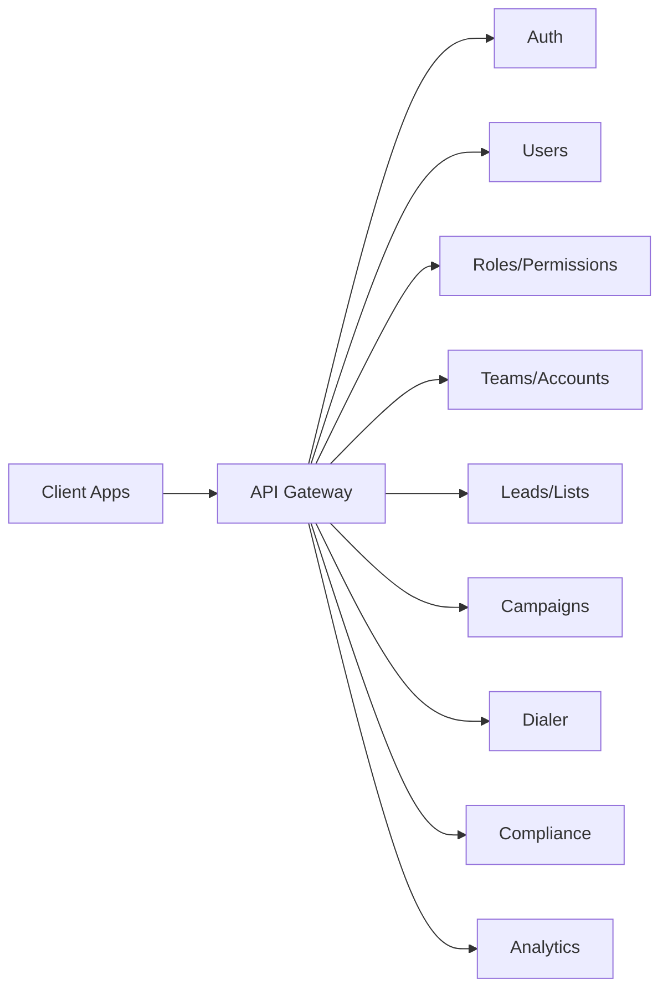

# API Endpoints (Draft)

## Diagram

## Auth
- POST /auth/login
- POST /auth/logout
- POST /auth/refresh

## Users
- GET /users
- POST /users
- GET /users/:id
- PATCH /users/:id
- DELETE /users/:id

## Roles/Permissions
- GET /roles
- GET /permissions

## Teams/Accounts
- GET /accounts
- POST /accounts
- GET /teams
- POST /teams

## Leads/Lists
- POST /lists/import
- GET /lists
- POST /lists
- GET /leads
- PATCH /leads/:id

## Campaigns
- GET /campaigns
- POST /campaigns
- PATCH /campaigns/:id
- POST /campaigns/:id/start
- POST /campaigns/:id/pause

## Dialer
- POST /dialer/call
- POST /dialer/stop
- POST /dialer/disposition

## Compliance
- GET /dnc
- POST /dnc
- GET /compliance/quiet-hours

## Analytics
- GET /analytics/summary
- GET /analytics/agent
