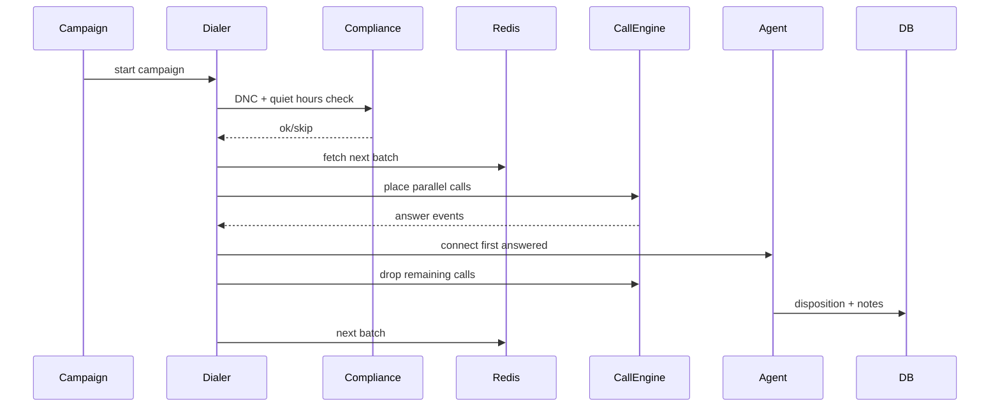
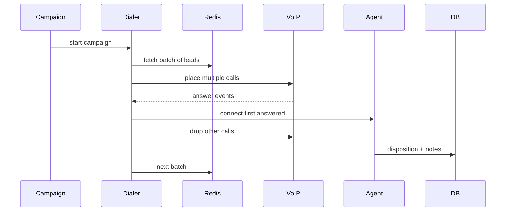
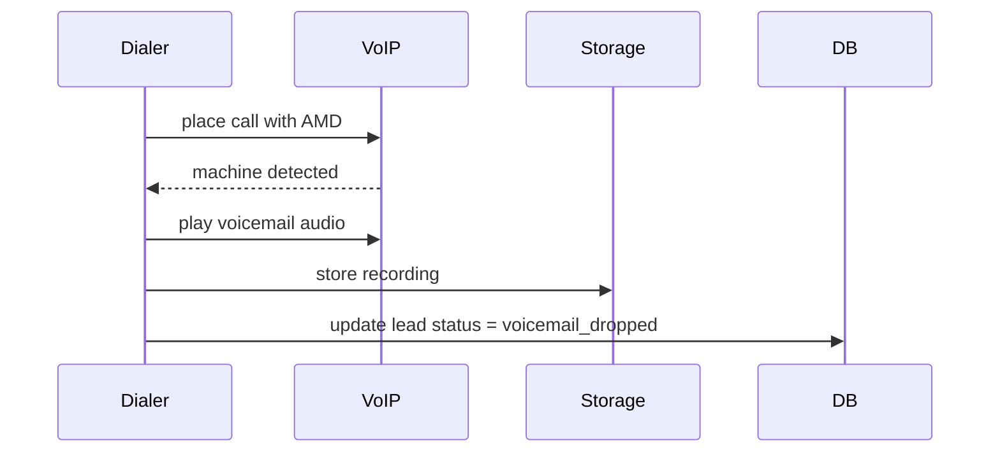

# Call Flows (Draft)

## Diagram

## Predictive dialing (overview)

## Voicemail drop (AMD)

## Compliance gate
- Check DNC registry before call
- Check quiet hours by state
- Skip call if any compliance rule fails
