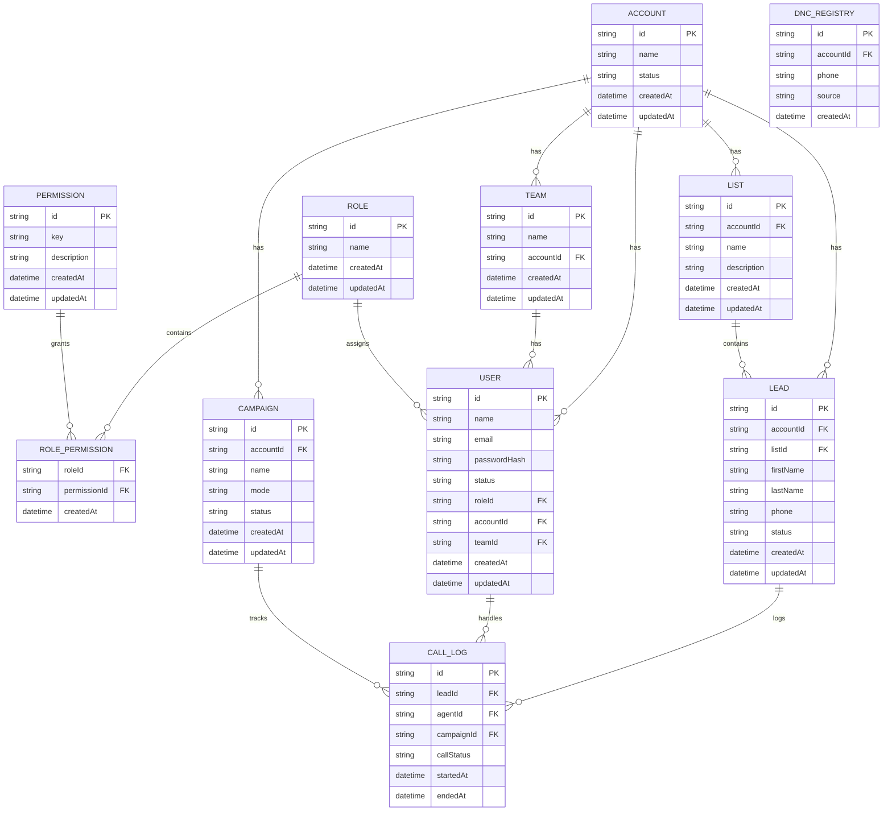

# Database Schema (Draft)

## Diagram

## users
- id (uuid, pk)
- name (text)
- email (text, unique)
- password_hash (text)
- role_id (uuid, fk)
- account_id (uuid, fk)
- team_id (uuid, fk)
- status (ACTIVE/INACTIVE)
- created_at (timestamp)
- updated_at (timestamp)

## roles
- id (uuid, pk)
- name (text)  -- admin/manager/agent
- created_at (timestamp)
- updated_at (timestamp)

## permissions
- id (uuid, pk)
- key (text, unique)
- description (text)
- created_at (timestamp)
- updated_at (timestamp)

## role_permissions
- role_id (uuid, fk)
- permission_id (uuid, fk)

## teams
- id (uuid, pk)
- name (text)
- account_id (uuid, fk)
- created_at (timestamp)
- updated_at (timestamp)

## accounts (sub-accounts)
- id (uuid, pk)
- name (text)
- status (ACTIVE/INACTIVE)
- created_at (timestamp)
- updated_at (timestamp)

## leads
- id (uuid, pk)
- account_id (uuid, fk)
- list_id (uuid, fk)
- first_name (text)
- last_name (text)
- phone (text)
- address (text)
- tags (text[])
- custom_fields (jsonb)
- status (NEW/CONTACTED/NO_ANSWER/DNC/BOOKED/CALLBACK)
- created_at (timestamp)
- updated_at (timestamp)

## lists
- id (uuid, pk)
- account_id (uuid, fk)
- name (text)
- description (text)
- created_at (timestamp)
- updated_at (timestamp)

## campaigns
- id (uuid, pk)
- account_id (uuid, fk)
- name (text)
- mode (predictive/power/preview)
- pacing (int)
- local_presence (bool)
- status (ACTIVE/PAUSED/ARCHIVED)
- created_at (timestamp)
- updated_at (timestamp)

## call_logs
- id (uuid, pk)
- lead_id (uuid, fk)
- agent_id (uuid, fk)
- campaign_id (uuid, fk)
- started_at (timestamp)
- ended_at (timestamp)
- disposition (text)
- recording_url (text)
- call_status (RINGING/CONNECTED/FAILED/COMPLETED)
- created_at (timestamp)
- updated_at (timestamp)

## dnc_registry
- id (uuid, pk)
- account_id (uuid, fk, optional)
- phone (text, unique)
- source (text)
- created_at (timestamp)
