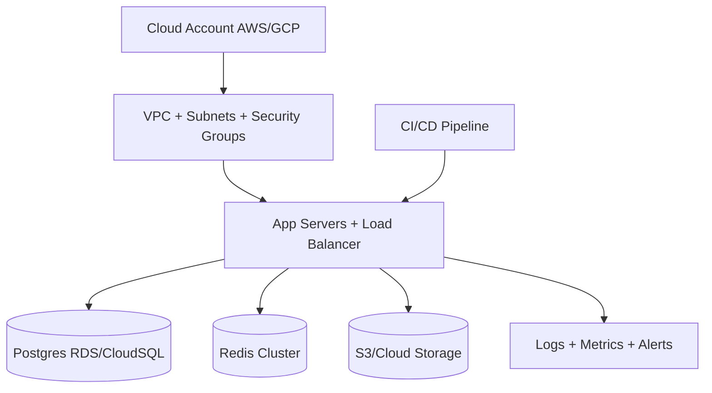

# Infrastructure Setup Checklist

## Diagram

## Cloud account
- AWS ya GCP account ready
- Billing alerts configured
- IAM users/roles minimal access

## Network
- VPC/VNet create
- Public + private subnets
- Security groups/firewall rules
- NAT gateway (private services)

## Compute
- App servers (API + services)
- Autoscaling group (future)
- Load balancer (HTTPS)

## Database
- Postgres RDS/Cloud SQL
- Automated backups
- Encryption at rest

## Redis
- Redis cluster (queue + realtime)
- Persistence config (AOF/RDB)

## Storage
- S3/Cloud Storage bucket
- Lifecycle rules (recordings)
- Access policies

## Observability
- Centralized logs (CloudWatch/Stackdriver)
- Metrics + alerts
- Uptime check

## CI/CD (baseline)
- Repo connected to GitHub Actions
- Build + test pipeline skeleton
- Deploy to staging
