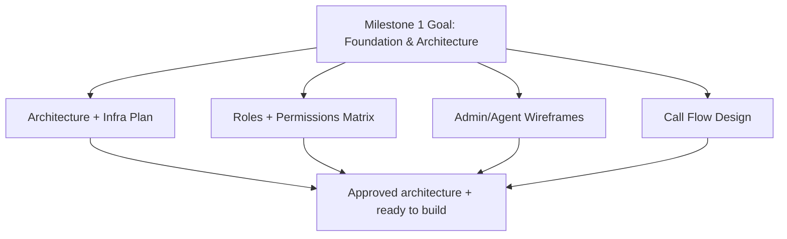

# Milestone 1: Foundation & Architecture

Ye milestone system ki bunyaad tayar karta hai. Iska focus architecture, infrastructure, roles, wireframes, aur call flow design par hai. Jab tak ye complete na ho, baqi features stable nahi ban sakte.

## Diagram

## Scope (is milestone me kya hoga)
- Cloud infrastructure plan + initial setup checklist
- Microservices architecture diagram + data flow
- User roles aur RBAC permissions matrix
- Auth plan (JWT, password hashing)
- Admin/Agent UI wireframes list
- Call flow design (predictive/power/preview, voicemail drop)

## Out of scope (is milestone me nahi)
- Actual dialer implementation
- CRM/SMS integrations
- Analytics dashboards
- Load testing

## Assumptions
- Cloud: AWS ya GCP
- DB: Postgres
- Queue/Cache: Redis
- Call engine: Asterisk / FreeSWITCH
- WebRTC: SIP.js / JsSIP
- Frontend: React (final)
- Backend: NestJS (final)

## Deliverables
- `docs/architecture.md` (system architecture + diagram)
- `docs/infra-setup.md` (infra checklist)
- `docs/rbac.md` (roles + permissions matrix)
- `docs/db-schema.md` (initial schema draft)
- `docs/api-endpoints.md` (API list draft)
- `docs/call-flows.md` (call flow + voicemail drop)
- `docs/wireframes.md` (screen inventory)

## Acceptance criteria
- Architecture diagram approved
- RBAC matrix approved
- Call flow logic approved
- Wireframes approved
- Infra checklist ready for setup

## Next steps (Milestone 2 se pehle)
- Tech stack lock karna (Node vs Python, React vs Vue)
- VoIP provider finalize karna
- Staging environment standup

## Status
- Milestone 1 complete

## Validation (local)
- Backend unit tests: `npm test` (run in `backend/`)
- Backend e2e tests: `npm run test:e2e` (run in `backend/`)
- Frontend build: `npm run build` (run in `frontend/`)
