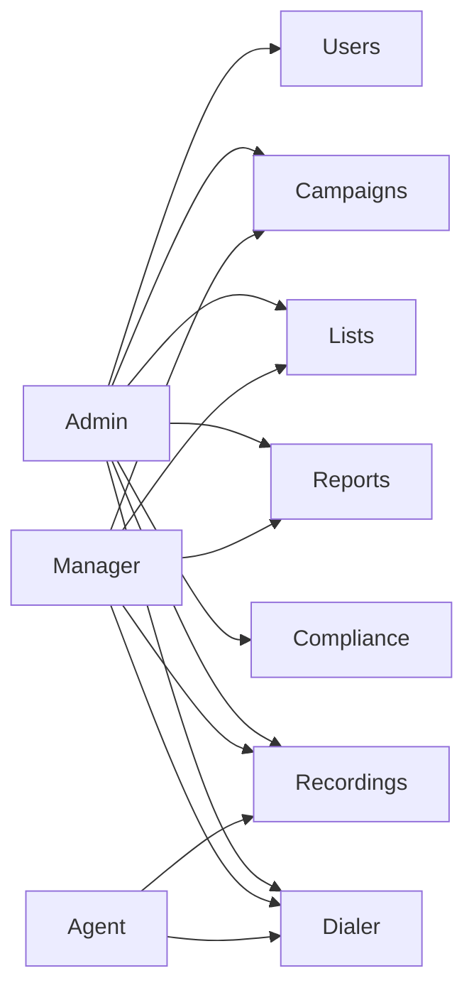

# RBAC Matrix (Draft)

## Diagram

## Roles
- Admin
- Manager
- Agent

## Permissions (draft)
| Permission | Admin | Manager | Agent |
| --- | --- | --- | --- |
| view_dashboard | yes | yes | limited |
| manage_users | yes | yes (team) | no |
| manage_roles | yes | no | no |
| manage_campaigns | yes | yes | no |
| assign_lists | yes | yes | no |
| view_reports | yes | yes (team) | limited |
| access_recordings | yes | yes (team) | own |
| dial_calls | yes | yes | yes |
| edit_scripts | yes | yes | no |
| manage_integrations | yes | no | no |
| compliance_settings | yes | limited | no |

## Notes
- Manager scope is limited to their team/sub-account
- Agent can only see assigned leads and own call history
- Sub-accounts isolate data per company
