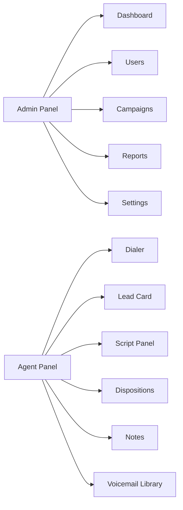

# Wireframes (Screen Inventory)

## Diagram

## Admin panel
- Dashboard: total calls, agents online, revenue, compliance alerts
- Users: add/edit/delete users, role assignment
- Teams/Accounts: create teams, sub-account isolation
- Campaigns: create, assign lists, pacing settings
- Reports: filters, export CSV
- Settings: integrations, API keys, compliance rules

## Agent panel
- Dialer main: start/stop, call timer
- Lead card: name, phone, address, tags
- Script panel: dynamic script for campaign
- Dispositions: interested, not interested, callback, DNC
- Notes: free text field
- Voicemail drop: select template
